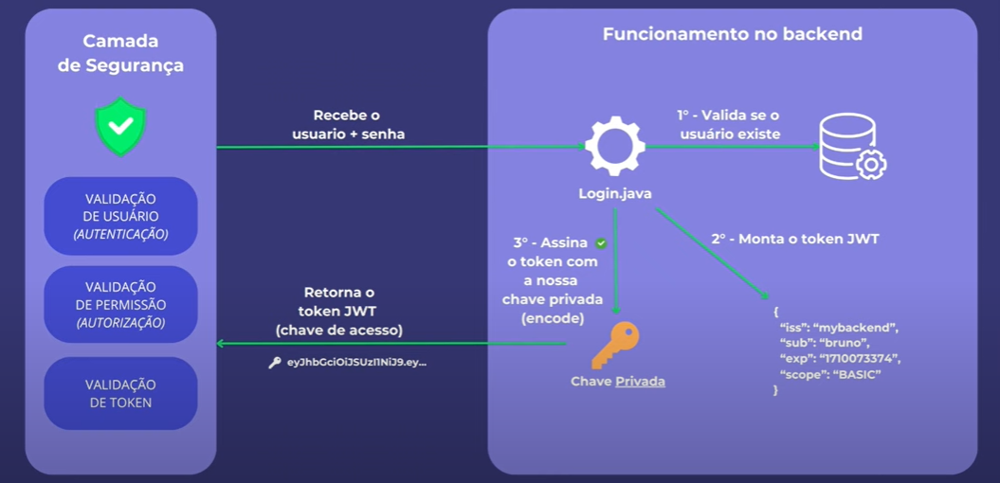

# Spring Security JWT Example

## Overview

This project is a comprehensive implementation of a RESTful API with Spring Boot, featuring JWT (JSON Web Token) based
authentication. It serves as a practical example of securing endpoints using Spring Security and JWT, ensuring that only
authenticated users can access protected resources.

This project cover the major aspects of Spring Security with JWT in a real-world scenario.

## Features

### 1. **User Registration & Authentication**

- **Registration:** Users can create an account by providing a username and password. The password is securely hashed
  using BCrypt.
- **Authentication:** Registered users can log in by providing their credentials. Upon successful authentication, a JWT
  token is generated and returned to the user.

Good example of the login logic in the application, in portuguese (will be translated soon):


### 2. **JWT Token Generation**

- After a successful login, the application generates a JWT token. This token is then used to authenticate and authorize
  users for subsequent requests.

### 3. **Token Validation**

- Each incoming request with a JWT token is intercepted by a filter that validates the token's integrity and checks its
  expiration. If valid, the request is allowed to proceed to the respective endpoint.

### 4. **Role-Based Access Control**

- Users are assigned roles (e.g., `ADMIN`, `BASIC`). Access to certain endpoints is restricted based on the
  user's role. This ensures that only users with appropriate permissions can access certain functionalities.

### 5. **Custom JWT Filter**

- A custom filter is used to intercept and validate JWT tokens in the request header. This filter ensures that every
  request to a secured endpoint is authenticated.

### 6. **Exception Handling**

- The project includes exception handling, returning meaningful HTTP status codes and error messages when an
  error occurs, but could be improved by adding more specific error handling for different scenarios.

### 7. **Secured Endpoints**

- Endpoints in the application are secured using Spring Security annotations and configurations. For example:
    - `/users/list-all`: list all users (requires `ROLE_ADMIN`).

### 8. **Database Integration**

- User details and roles are stored in a relational database (MySQL running on a docker container). The application uses
  Spring Data JPA to interact with the database.

### Directory Breakdown

- **`config`:** Contains configuration classes for Spring Security, JWT and admin user creation.
- **`controller`:** Handles HTTP requests and responses.
- **`service`:** Implements business logic and interacts with the repository layer.
- **`dto`:** Data Transfer Objects used to carry data between processes, reducing coupling.
- **`domain`:** Represents the domain model, including entities and enums.
- **`repository`:** Interfaces for data persistence using Spring Data JPA.
- **`JwtSecurityApplication.java`:** The main entry point for the Spring Boot application.

## How to Run the Project

### Prerequisites

- Java 21 or higher
- Maven 3.6.0 or higher
- A database (e.g., MySQL already configured)

### Steps

1. **Clone the repository:**

   ```bash
   git clone [link of the reposiroty]
   cd springsecurity
   ```

2. **Configure Database:**

   Modify `application.properties` to point to your database. By default, the project uses a MySQL database running on a
   docker container.

    ```bash
     cd docker
     docker-compose up -d
    ```

3. **Build the project:**

   ```bash
   mvn clean install
   ```

4. **Run the application:**

   ```bash
   mvn spring-boot:run
   ```

5. **Access the API:**
   Use a tool like Postman or curl to interact with the API. Start by registering a user and then log in to receive a
   JWT token. Use this token in the Authorization header to access secured endpoints.

## API Endpoints

### Public Endpoints

- `POST users/new`: Register a new user. - Request Body: `{"username": "user", "password": "password"}`
- `POST /login`: Authenticate a user. - Request Body: `{"username": "user", "password": "password"}`

### Secured Endpoints

- `GET /users/list-all`: List all users. (Requires `ADMIN` role)
- `POST /tweets/new`: Create a new tweet. (Requires authenticated user)
- `DELETE /tweets/{id}`: Delete a tweet by ID. (Only the tweet owner or `ADMIN` role can delete)
- `GET /tweets/feed`: Get all tweets descending by creation date. (Requires authenticated user)

## Contributing

Feel free to contribute to this project by submitting issues or pull requests. Make sure to follow the coding guidelines
and include appropriate tests with your contributions.
